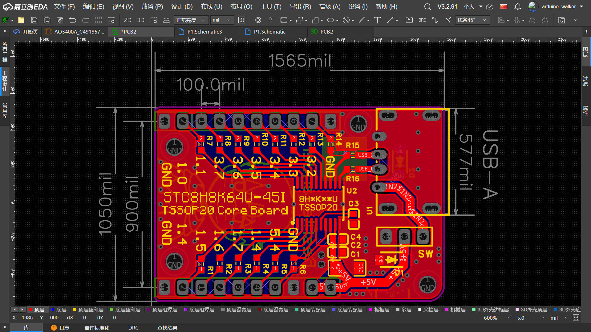
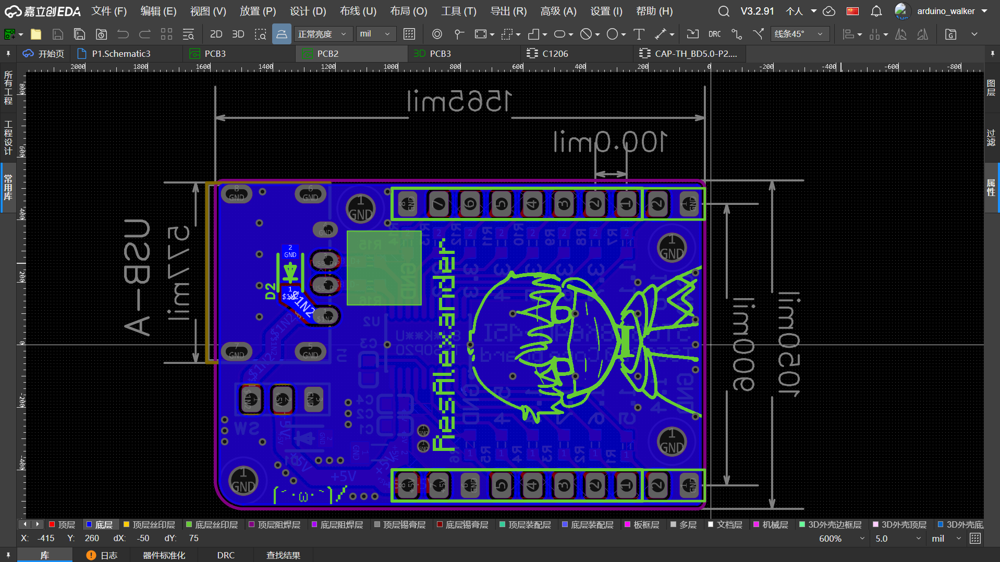

<!--EN版本以后再放上去。-->

<!--传送门-->
🖼️ **[画廊 Gallery](#gallery)** 
<!--👋 **Not a Chinese speaker? [Jump to English Version! 🚀](#english-version)**-->

<!--标题-->
# STC8H8K64U _TSSOP20_ Core Board || 最小系统板
### 兼容大多数STC8H\_K\_\_U _TSSOP20_ MCUs
### Compatible with most STC8H\_K\_\_U _TSSOP20_ MCUs

<!--cover-->

为STC8H8K64U-45I- _TSSOP20_ 设计的极简开发板。 
设计初衷是，自己有另一个需要该单片机的项目，需要先用此项目进行调试和方案验证。 
也可用于其它 基于 STC8H_K\*\*U-\**I-_TSSOP20_ 的项目 的方案验证。 
 

\***重要提示：**
 为了便于焊接，使用了USB Type-A母座，作为USB供电和烧录接口。 
或许你需要一根USB公对公连接线（）
   

<!--
---
# <a id="english-version">STC8H8K64U-45I-_TSSOP20_ Core Board</a>

This is a minimalist development board designed for the STC8H8K64U-45I- _TSSOP20_ MCU. 
I created this board as a dedicated platform to debug and validate hardware/firmware solutions before integrating this MCU into my other primary projects.
 
Can also be used for solution verification in other projects based on the STC8H*K\*\*U-\**I-_TSSOP20_ microcontroller.
-->

---
## <a id="gallery">Gallery</a>
<!---->
<!--最前面已经展示过了，不再重复展示-->

