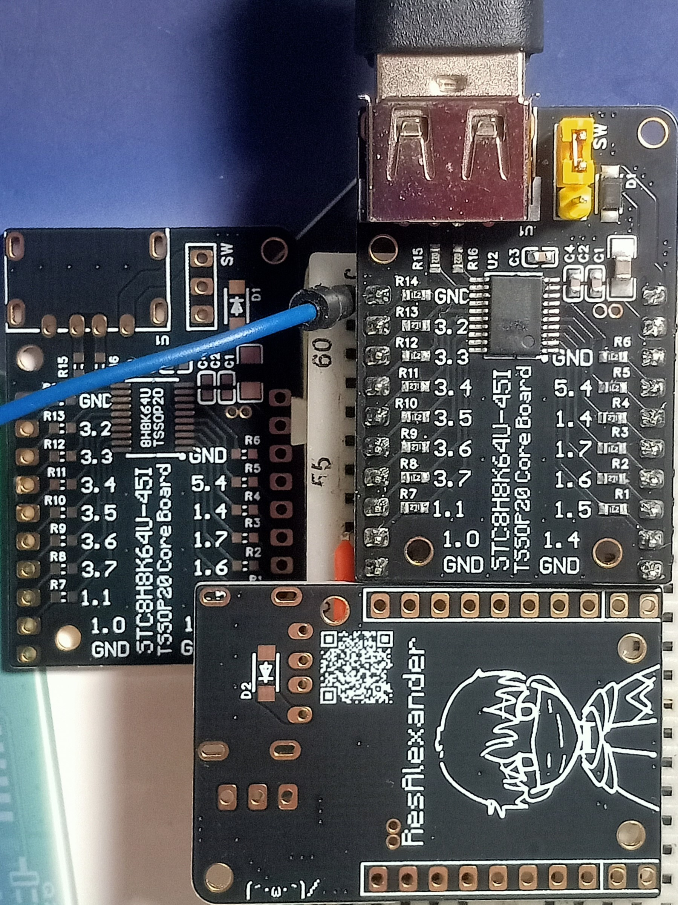
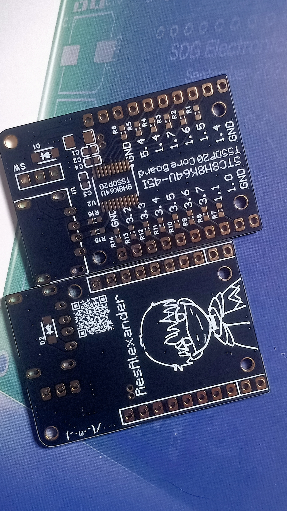

<!--EN版本以后再放上去。-->

<!--传送门-->
<!-- 🖼️ **[画廊 Gallery](#gallery)**（有实物图哦）  -->
**Not a Chinese speaker? [Jump to English Version! 🚀](#english-version)**  
**日本語をお探しですか？ [日本語版へジャンプ！ 🇯🇵](#japanese-version)**

<!--标题-->
# \[Verified 已验证] STC8H8K64U _TSSOP20_ Core Board || 最小系统板
### 兼容大多数STC8H\_K\_\_U _TSSOP20_ MCUs
### Compatible with most STC8H\_K\_\_U _TSSOP20_ MCUs
### ほとんどの STC8H_K__U (TSSOP20) マイコンと互換性があります。

<!--cover-->
<!--  -->
<table border="0">
  <tr>
    <td rowspan="2" width="45%" valign="middle" align="center">
      
    </td>
    <td width="50%" align="center">
      
    </td>
  </tr>
  <tr>
    <td width="50%" align="center">
      
    </td>
  </tr>
</table>

### @brief
为STC8H8K64U-45I- _TSSOP20_ 设计的极简开发板，可以直接插在面包板上调戏awa 
设计初衷是，自己有另一个需要该单片机的项目，需要先用此项目进行调试和方案验证 
也可用于其它 基于 STC8H_K__U-__I- _TSSOP20_ 项目 的方案验证 
 

### 重要提示
1. 为便于焊接，使用了USB Type-A母座，作为USB供电和烧录接口。 
或许你需要一根USB公对公连接线，如果到京东/amazon之类的地方去买，就把bom中的公对公连接线删了吧。
2. 这个项目没有boot/rst按钮，如果有下载切换/重置的需求，用跳线或者外置按钮。
3. tssop20封装可能挺难焊。手工焊接的话，**不管烙铁还是风枪，都请准备好吸锡带和助焊剂。**

------

### @brief
A minimalist dev board for STC8H8K64U-45I (TSSOP20)—plug it straight into your breadboard and start messing around! owo 
Originally designed as a testbed for another project of mine that uses this MCU. It’s perfect for debugging and proof-of-concept (PoC) work. 
You can also use it for verifying any other STC8H_K__U-__I (TSSOP20) based designs. 
 

### Important Notes

1. USB Type-A Port: For easier soldering, I used a Type-A female socket for power and flashing.
* Note: You'll need a USB-A to USB-A cable. If you're picking one up on Amazon or similar, feel free to remove it from the BOM.
2. No On-board Buttons: This project lacks physical Boot/Reset buttons. If you need to toggle download modes or reset the chip, please use jumpers or external buttons.
3. Soldering Challenge: The TSSOP20 package can be a pain to solder by hand. Whether you're using a soldering iron or a hot air station, keep your solder wick and flux handy!

------

(Google Geminiによる翻訳
### @brief
STC8H8K64U-45I (TSSOP20) 向け極小開発ボード。ブレッドボードに直挿しして「いじり倒し」ちゃってください =w= 
開発のきっかけは、このマイコンを使う別のプロジェクトのデバッグとプロトタイプ検証用です。他の STC8H_K__U-__I (TSSOP20) ベースのプロジェクトの検証にも使い回せます。 

### 注意事項

   1. USB Type-A メス端子採用： はんだ付けしやすさを優先し、給電と書き込み用に Type-A メスを採用しました。
   * オス－オスのUSBケーブルが必要です。Amazonなどで別途購入する場合は、BOM（部品表）からケーブルを削除してください。
   2. ボタン類なし： Boot/Resetボタンは載せていません。書き込み切り替えやリセットが必要な場合は、ジャンパピンや外付けボタンで対応してください。
   3. はんだ付けの難易度： TSSOP20パッケージは手はんだだと少し手強いかもしれません。コテでもヒートガンでも、吸取線とフラックスを必ず用意しておいてください。

<!--
---
# <a id="english-version">STC8H8K64U-45I-_TSSOP20_ Core Board</a>

This is a minimalist development board designed for the STC8H8K64U-45I- _TSSOP20_ MCU. 
I created this board as a dedicated platform to debug and validate hardware/firmware solutions before integrating this MCU into my other primary projects.
 
Can also be used for solution verification in other projects based on the STC8H*K\*\*U-\**I-_TSSOP20_ microcontroller.
-->
<!--
---
## <a id="gallery">Gallery</a>
<video src="blink_real.mp4" width="100%" controls></video>

-->
